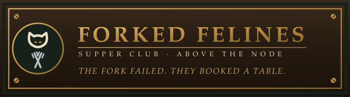

# Forked Felines

**The official KNOT HEADS companion collection: up to 3,333 hand-drawn felines, each one a deterministic SVG inscribed whole on Bitcoin.**

[**Open the live product**](https://forkedfelines.art) · [**Read the House Manual**](https://docs.forkedfelines.art/) · [**Get support**](https://forkedfelines.art/support)

---

This repository is the official public documentation for Forked Felines. It contains collector guides, exact product facts, safety guidance, provenance explanations, and the public API reference. The production application is closed source; nothing here implies otherwise.

## Quick facts

Every number below is validated against the live product contract at [`/api/v1/product`](https://forkedfelines.art/api/v1/product). Last verified: **2026-08-29**.

| Fact | Value |
| --- | --- |
| Maximum supply | 3,333 felines |
| Public collection price | 8,888 sats |
| Knot Heads holder credit | one free mint (0-sat collection price) per eligible head |
| Holder eligibility snapshot | Bitcoin block 963,238, fixed forever |
| Initial service fee | 1,500 sats |
| Network, delivery, and service costs | calculated live, shown separately, payable on every mint |
| Artwork | deterministic SVG, hash-verified, inscribed whole on Bitcoin |
| Pricing contract | `forked-felines.community-remediation/v4` |

## Mint in three steps

1. **Open [forkedfelines.art/mint](https://forkedfelines.art/mint)** and read the posted rates. No wallet is needed to see the full offer.
2. **Enter the Bitcoin address that should receive the Feline.** Connecting a wallet just fills this field for you; it never authorizes a payment. The house checks that address against the block 963,238 guest list and applies any free-mint credits automatically.
3. **Review one exact total, then pay.** The signed quote itemizes the collection price, network fee, delivery, and the 1,500-sat service fee before your wallet opens. Approve exactly what you read, then watch the kitchen ticket track each real Bitcoin state until your Feline is served.

The full walkthrough, including every order state and how to resume after closing your browser, is in [Mint in 3 steps](docs/start-here/mint-in-3-steps.md).

## Choose your path

| You are | Start here |
| --- | --- |
| New to Forked Felines | [What is Forked Felines?](docs/start-here/what-is-forked-felines.md) |
| A Knot Heads holder | [Knot Heads holder start](docs/start-here/knot-heads-holder-start.md) |
| A public minter | [Public minter start](docs/start-here/public-minter-start.md) |
| Here to look at the art | [The plates](docs/collection/the-plates.md) |
| Checking a Feline you own | [My Booth](docs/collectors/my-booth.md) |
| Verifying artwork yourself | [Verify a Feline](docs/collection/verify-a-feline.md) |
| Worried about a scam | [What we will never ask](docs/safety/what-we-will-never-ask.md) |
| Building against the public API | [Public API](docs/reference/public-api.md) |

## How ownership works

A Feline is a Bitcoin inscription. The whole artwork, every byte of the SVG, lives on Bitcoin itself: no server, no image host, no metadata URL. The house records the seed, the recipe digest, the byte digest, and every trait weight before a Feline is ever reserved, so each one can show its working. Read [Whole on Bitcoin](docs/collection/whole-on-bitcoin.md) and [Verified artwork](docs/collection/verified-artwork.md).

## Wallets and fees

- The **receiving address** gets the Feline and decides holder standing. The **paying wallet** settles the bill. They may be different on purpose. See [Receiving vs payment address](docs/collectors/receiving-vs-payment-address.md).
- Connecting a wallet never authorizes payment. Every cost is shown as one exact total before any signing request. See [Prices and fees](docs/collectors/prices-and-fees.md) and [Wallet signing](docs/collectors/wallet-signing.md).

## Safety

The house will never DM first, never ask for your seed phrase, and never ask you to send funds to an address outside a signed quote. Financial facts are never jokes. Read [Stay safe](docs/safety/stay-safe.md) and [What we will never ask](docs/safety/what-we-will-never-ask.md). Report vulnerabilities privately per [SECURITY.md](SECURITY.md).

## Documentation map

- **Start here**: [what it is](docs/start-here/what-is-forked-felines.md) · [30-second explanation](docs/start-here/explain-it-in-30-seconds.md) · [mint in 3 steps](docs/start-here/mint-in-3-steps.md) · [holder start](docs/start-here/knot-heads-holder-start.md) · [public start](docs/start-here/public-minter-start.md)
- **Collectors**: [wallets](docs/collectors/supported-wallets.md) · [addresses](docs/collectors/receiving-vs-payment-address.md) · [prices and fees](docs/collectors/prices-and-fees.md) · [signing](docs/collectors/wallet-signing.md) · [order status](docs/collectors/order-status.md) · [My Booth](docs/collectors/my-booth.md) · [credits](docs/collectors/community-credits.md) · [remediation](docs/collectors/remediation-and-refunds.md)
- **The collection**: [the plates](docs/collection/the-plates.md) · [how the art is made](docs/collection/how-the-art-is-made.md) · [whole on Bitcoin](docs/collection/whole-on-bitcoin.md) · [trait catalogue](docs/collection/trait-catalogue.md) · [traits and odds](docs/collection/traits-and-odds.md) · [verified artwork](docs/collection/verified-artwork.md) · [provenance](docs/collection/provenance.md) · [verify a Feline](docs/collection/verify-a-feline.md) · [the wall](docs/collection/collection-wall.md) · [Knot Heads relationship](docs/collection/knot-heads-relationship.md)
- **Safety**: [stay safe](docs/safety/stay-safe.md) · [what we will never ask](docs/safety/what-we-will-never-ask.md) · [privacy](docs/safety/privacy.md) · [reporting a security problem](docs/safety/reporting-a-security-problem.md)
- **Help**: [troubleshooting](docs/help/troubleshooting.md) · [payment and confirmation](docs/help/payment-and-confirmation.md) · [getting support](docs/help/getting-support.md)
- **Reference**: [official product facts](docs/reference/official-product-facts.md) · [public API](docs/reference/public-api.md) · [order states](docs/reference/order-states.md) · [status contract](docs/reference/status-contract.md) · [terminology](docs/reference/terminology.md)
- **Changes**: [changelog](CHANGELOG.md)

## The plates

Eight confirmed Felines are hung in [the gallery](docs/collection/the-plates.md) at full size, each with a catalogue entry: plate, edition, medium, dimensions, byte length, digest, setting odds, inscription, and the day it was served.

The artwork files under `docs/assets/plates/` are the real thing. They are the exact bytes the product serves for those editions, saved here so the manual can show what it describes, and so that the digest printed under each frame is the digest of a file you can hash yourself. The publication gate re-hashes every one of them on every build. See [Verify a Feline](docs/collection/verify-a-feline.md).

## Official links

- Live product: <https://forkedfelines.art>
- Documentation site: <https://docs.forkedfelines.art/>
- Support (in the app, private): <https://forkedfelines.art/support>
- House status: <https://forkedfelines.art/status>

Anything not listed above is not official. Staff will never DM first.

## About this repository

The Markdown under `docs/` is the single source of truth; the documentation site is built from it without changing a word. Product facts are pinned in `facts/facts.json` and validated in CI against the live product contract. The collection census and the plate artwork are read from the public collection endpoint by `tools/refresh-collection-snapshot.mjs`, and the gallery, trait catalogue, rarity table and digest checker are generated from that snapshot rather than typed. See [CONTRIBUTING.md](CONTRIBUTING.md).

Corrections are welcome through issues and pull requests; product support belongs in [the app's support desk](https://forkedfelines.art/support), not in the issue tracker.

| File | What it is |
| --- | --- |
| [`docs.manifest.json`](docs.manifest.json) | The Bitcoin Universe documentation manifest for this repository |
| [`facts/facts.json`](facts/facts.json) | The pinned product facts every page is validated against |
| [`facts/collection-observed.json`](facts/collection-observed.json) | The trait vocabulary, rarity tiers and plate digests, with the date they were read |
| [`LICENSE.md`](LICENSE.md) | What may be reused, and what may not |

Copyright 2026 Bitcoin Universe. See [LICENSE.md](LICENSE.md).

*A collectible, not an investment.*
